# PixShift Visual Summary

**Version:** 1.2  
**Date:** 2024-11-09  
**Status:** Complete PRD with Visual Diagrams

This document provides a comprehensive visual overview of the PixShift application architecture, workflows, and processes. All diagrams are based on the Product Requirements Document (PRD) and represent the complete system design.

---

## Table of Contents

1. [System Overview](#1-system-overview)
2. [User Flows](#2-user-flows)
3. [Business Logic](#3-business-logic)
4. [Data Architecture](#4-data-architecture)
5. [Administration](#5-administration)
6. [Deployment & Operations](#6-deployment--operations)
7. [Testing & Quality](#7-testing--quality)

---

## 1. System Overview

### 1.1 System Architecture Overview

This diagram shows the high-level system architecture with all components and their relationships.

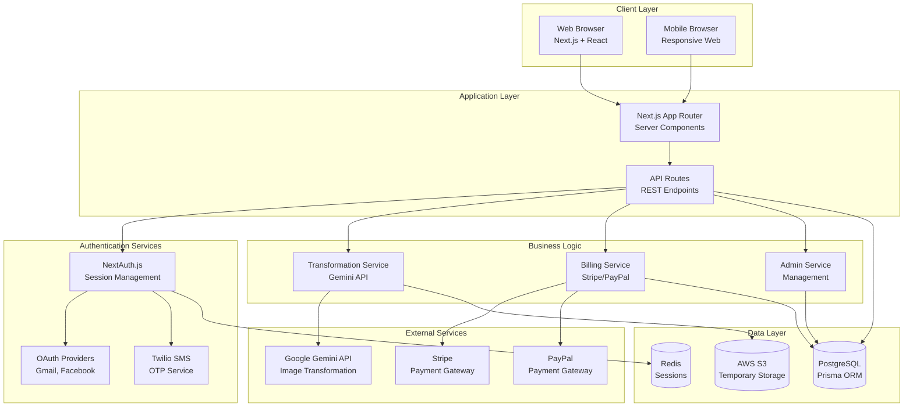

**Key Components:**
- **Client Layer**: Web and mobile browsers accessing the Next.js application
- **Application Layer**: Next.js App Router with Server Components and REST API Routes
- **Authentication Services**: OAuth providers (Gmail, Facebook) and Twilio SMS for OTP
- **Business Logic**: Transformation, Billing, and Admin services
- **Data Layer**: PostgreSQL database, Redis for sessions, AWS S3 for temporary image storage
- **External Services**: Google Gemini API, Stripe, PayPal

---

## 2. User Flows

### 2.1 User Authentication Flow

Complete authentication sequence for all authentication methods (OAuth and SMS OTP).

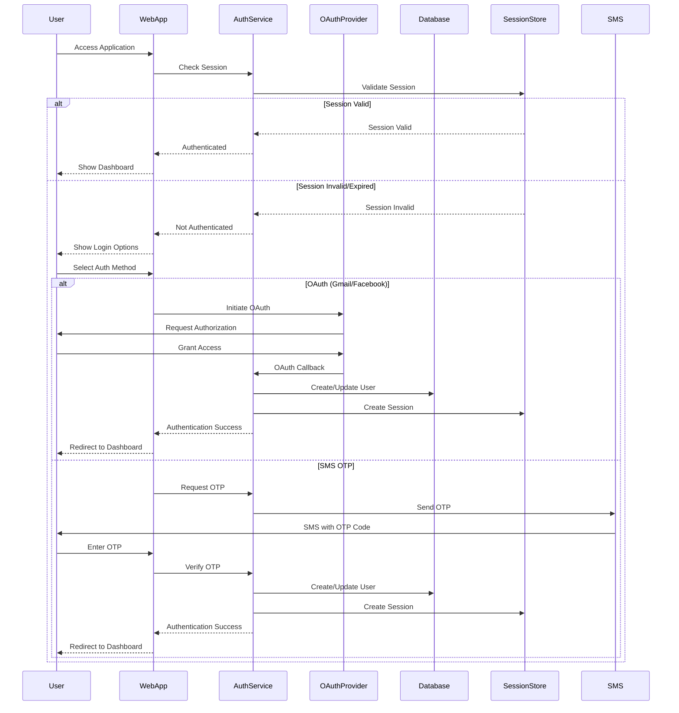

**Authentication Methods:**
- **OAuth**: Gmail and Facebook OAuth 2.0 flow
- **SMS OTP**: Twilio SMS with 6-digit OTP codes (5-minute expiration, single-use)
- **Session Management**: Server-side sessions with Redis or database storage

---

### 2.2 Image Transformation Workflow

End-to-end image transformation process from upload to download and sharing.

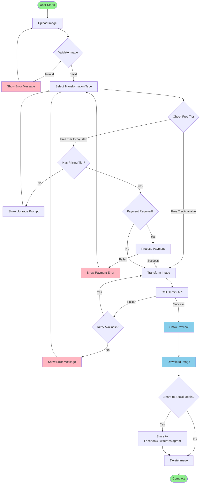

**Key Steps:**
1. **Upload**: User uploads image (max 10MB, JPEG/PNG/WebP)
2. **Validation**: Client and server-side validation
3. **Free Tier Check**: Check if user has free transformations remaining
4. **Payment**: Process payment if free tier exhausted
5. **Transformation**: Call Gemini API to transform image
6. **Preview**: Show transformed image preview
7. **Download**: User downloads transformed image
8. **Sharing**: Optional social media sharing
9. **Cleanup**: Delete image after download (within 5 minutes)

---

### 2.3 Billing and Payment Flow

Payment processing and billing logic for paid transformations.

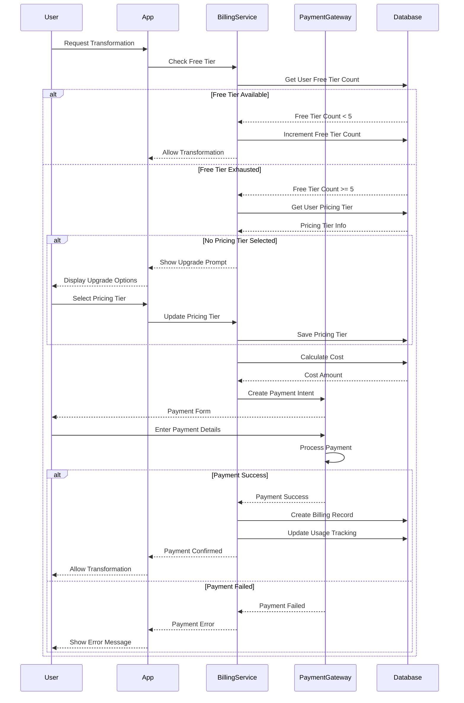

**Billing Features:**
- **Free Tier**: 5 free transformations per user
- **Pricing Tiers**: Configurable per-image or monthly limit models
- **Payment Gateways**: Stripe (primary), PayPal (configurable)
- **Usage Tracking**: Track all transformations and billing records

---

## 3. Business Logic

### 3.1 Free Tier Enforcement Flow

Free tier checking and enforcement logic with atomic operations.

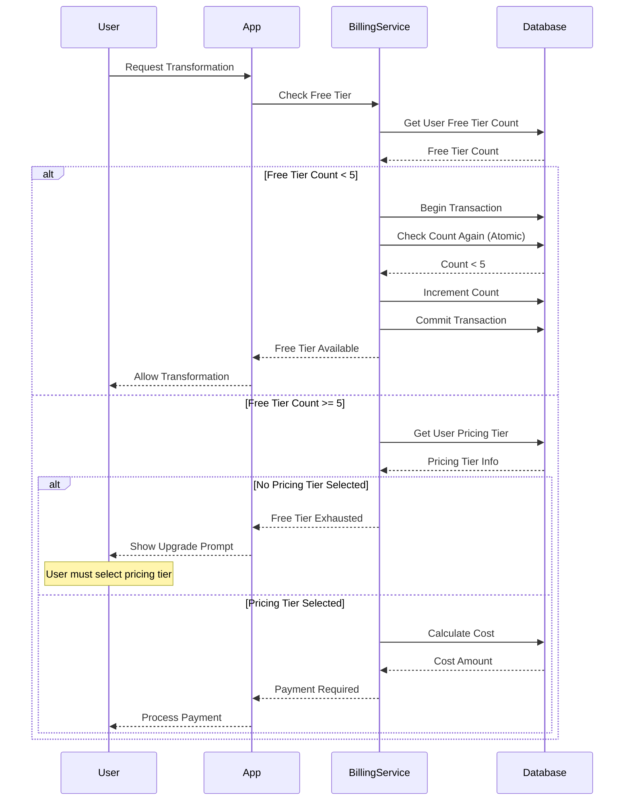

**Key Features:**
- **Atomic Operations**: Database transactions prevent race conditions
- **Free Tier Limit**: 5 free transformations per user
- **Upgrade Prompts**: Non-intrusive prompts when free tier exhausted
- **Pricing Tier Selection**: Users can choose per-image or monthly limit models

---

### 3.2 Error Handling Flow

Error categorization and handling for all error types.

```mermaid
flowchart TD
    START([User Action]) --> ACTION[Execute Action]
    ACTION --> SUCCESS{Success?}
    
    SUCCESS -->|Yes| COMPLETE([Complete])
    
    SUCCESS -->|No| CATEGORIZE{Categorize Error}
    
    CATEGORIZE -->|Authentication| AUTH_ERROR[Authentication Error]
    CATEGORIZE -->|Billing| BILLING_ERROR[Billing Error]
    CATEGORIZE -->|API| API_ERROR[API Error]
    CATEGORIZE -->|Network| NETWORK_ERROR[Network Error]
    CATEGORIZE -->|Validation| VALIDATION_ERROR[Validation Error]
    
    AUTH_ERROR --> AUTH_MSG[Show Message:<br/>"Please login again"]
    AUTH_ERROR --> AUTH_LOG[Log Error with Context]
    AUTH_LOG --> AUTH_REDIRECT[Redirect to Login]
    
    BILLING_ERROR --> BILLING_MSG[Show Message:<br/>"Payment failed.<br/>Please check your payment method"]
    BILLING_ERROR --> BILLING_LOG[Log Error with Context]
    BILLING_LOG --> BILLING_RETRY[Offer Retry Option]
    
    API_ERROR --> API_RETRY{Retry Available?}
    API_RETRY -->|Yes| API_RETRY_ACTION[Retry with Exponential Backoff]
    API_RETRY_ACTION --> ACTION
    API_RETRY -->|No| API_MSG[Show Message:<br/>"Transformation failed.<br/>Please try again later"]
    API_ERROR --> API_LOG[Log Error with Context]
    API_LOG --> API_MSG
    
    NETWORK_ERROR --> NETWORK_MSG[Show Message:<br/>"Network error.<br/>Please check your connection"]
    NETWORK_ERROR --> NETWORK_LOG[Log Error with Context]
    NETWORK_LOG --> NETWORK_RETRY[Offer Retry Option]
    
    VALIDATION_ERROR --> VALIDATION_MSG[Show Message:<br/>"Invalid input.<br/>Please check your data"]
    VALIDATION_ERROR --> VALIDATION_LOG[Log Error with Context]
    VALIDATION_LOG --> VALIDATION_FORM[Highlight Form Errors]
    
    style START fill:#90EE90
    style COMPLETE fill:#90EE90
    style AUTH_ERROR fill:#FFB6C1
    style BILLING_ERROR fill:#FFB6C1
    style API_ERROR fill:#FFB6C1
    style NETWORK_ERROR fill:#FFB6C1
    style VALIDATION_ERROR fill:#FFB6C1
```

**Error Categories:**
- **Authentication Errors**: Session expired, invalid credentials
- **Billing Errors**: Payment declined, insufficient funds
- **API Errors**: Gemini API failures, rate limits
- **Network Errors**: Connection timeouts, network issues
- **Validation Errors**: Invalid input, file format issues

---

### 3.3 Configuration Management Flow

Configuration loading and validation at application startup.

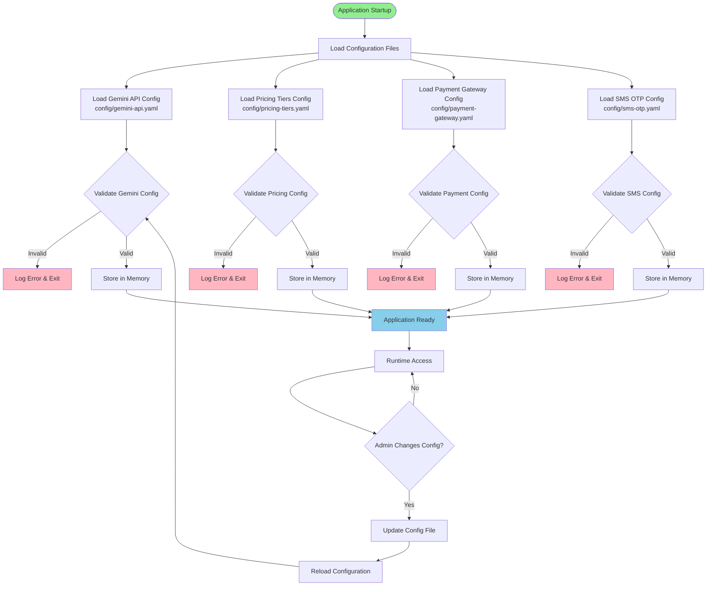

**Configuration Files:**
- **Gemini API Config**: API key, model settings, rate limits
- **Pricing Tiers Config**: Tier definitions, pricing models, features
- **Payment Gateway Config**: Stripe/PayPal credentials, settings
- **SMS OTP Config**: Twilio credentials, OTP settings

---

## 4. Data Architecture

### 4.1 Database Schema Relationships

Entity-relationship diagram showing all database tables and their relationships.

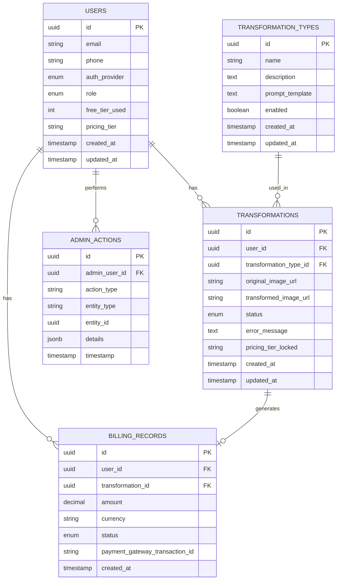

**Database Tables:**
- **USERS**: User accounts with authentication and role information
- **TRANSFORMATION_TYPES**: Available transformation types (managed by admins)
- **TRANSFORMATIONS**: Image transformation records with status tracking
- **BILLING_RECORDS**: Payment and billing transaction records
- **ADMIN_ACTIONS**: Audit log for all admin actions

---

## 5. Administration

### 5.1 Admin Dashboard Flow

Complete admin user workflows for system management.

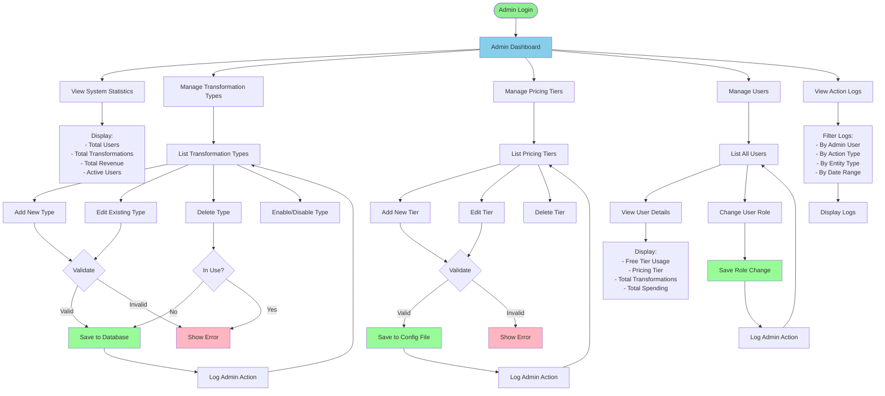

**Admin Features:**
- **System Statistics**: View total users, transformations, revenue
- **Transformation Type Management**: Add, edit, delete, enable/disable types
- **Pricing Tier Management**: Configure pricing tiers via UI
- **User Management**: View users, change roles, view statistics
- **Action Logging**: Complete audit trail for all admin actions

---

### 5.2 Epic Dependencies and Sequencing

How epics and stories relate and depend on each other.

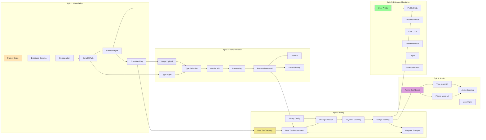

**Epic Summary:**
- **Epic 1**: Foundation & Core Infrastructure (6 stories)
- **Epic 2**: Core Transformation Workflow (8 stories)
- **Epic 3**: Free Tier & Billing System (7 stories)
- **Epic 4**: Admin Features & Dashboard (5 stories)
- **Epic 5**: User Profile & Enhanced Features (7 stories)
- **Total**: 33 stories across 5 epics

---

## 6. Deployment & Operations

### 6.1 Deployment Architecture

Infrastructure and deployment components for both primary (Vercel) and alternative (AWS/Azure) deployments.

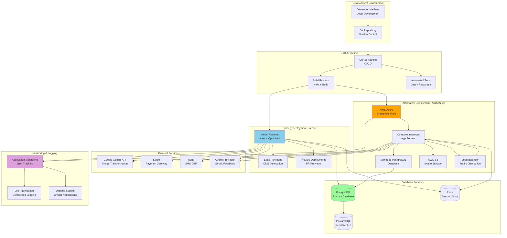

**Deployment Options:**
- **Primary**: Vercel (Next.js optimized, zero-config, CDN, edge functions)
- **Alternative**: AWS/Azure (enterprise scale, more control, lower cost at scale)
- **Database**: Managed PostgreSQL with read replicas
- **Monitoring**: Application monitoring, log aggregation, alerting

---

### 6.2 Deployment Flow

Complete deployment process from code commit to production.

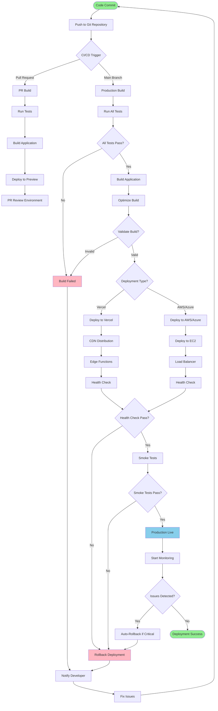

**Deployment Stages:**
1. **Code Commit**: Developer commits code to Git
2. **CI/CD Trigger**: GitHub Actions triggered on PR or main branch
3. **Testing**: Run all tests (unit, integration, E2E)
4. **Build**: Build Next.js application
5. **Deploy**: Deploy to Vercel or AWS/Azure
6. **Health Check**: Verify deployment health
7. **Smoke Tests**: Run critical path tests
8. **Monitoring**: Start monitoring and alerting
9. **Auto-Rollback**: Automatic rollback on critical issues

---

### 6.3 CI/CD Pipeline Flow

Complete CI/CD pipeline from source control to deployment.

```mermaid
flowchart LR
    subgraph "Source Control"
        GIT[Git Repository<br/>GitHub/GitLab]
        PR[Pull Request]
        MAIN[Main Branch]
    end
    
    subgraph "CI Pipeline"
        LINT[Lint Code<br/>ESLint]
        FORMAT[Format Code<br/>Prettier]
        UNIT_CI[Unit Tests<br/>Jest]
        INT_CI[Integration Tests<br/>Jest]
        BUILD_CI[Build Application<br/>Next.js]
        E2E_CI[E2E Tests<br/>Playwright]
    end
    
    subgraph "Quality Gates"
        COVERAGE[Code Coverage<br/>>= 70%]
        SECURITY[Security Scan<br/>Dependencies]
        QUALITY[Quality Check<br/>Code Review]
    end
    
    subgraph "Deployment"
        PREVIEW_DEPLOY[Preview Deployment<br/>Vercel Preview]
        STAGING_DEPLOY[Staging Deployment<br/>Staging Environment]
        PROD_DEPLOY[Production Deployment<br/>Vercel/AWS]
    end
    
    subgraph "Post-Deployment"
        SMOKE[Smoke Tests<br/>Health Checks]
        MONITOR_DEPLOY[Monitoring<br/>Error Tracking]
        ROLLBACK_DEPLOY[Auto-Rollback<br/>If Critical Issues]
    end
    
    GIT --> PR
    GIT --> MAIN
    
    PR --> LINT
    MAIN --> LINT
    
    LINT --> FORMAT
    FORMAT --> UNIT_CI
    UNIT_CI --> INT_CI
    INT_CI --> BUILD_CI
    BUILD_CI --> E2E_CI
    
    E2E_CI --> COVERAGE
    COVERAGE --> SECURITY
    SECURITY --> QUALITY
    
    QUALITY -->|PR| PREVIEW_DEPLOY
    QUALITY -->|Main| STAGING_DEPLOY
    
    PREVIEW_DEPLOY --> SMOKE
    STAGING_DEPLOY --> SMOKE
    SMOKE --> PROD_DEPLOY
    
    PROD_DEPLOY --> MONITOR_DEPLOY
    MONITOR_DEPLOY --> ROLLBACK_DEPLOY
    
    ROLLBACK_DEPLOY -->|Issues| PROD_DEPLOY
    
    style GIT fill:#90EE90
    style QUALITY fill:#FFE4B5
    style PROD_DEPLOY fill:#87CEEB
    style MONITOR_DEPLOY fill:#DDA0DD
    style ROLLBACK_DEPLOY fill:#FFB6C1
```

**CI/CD Stages:**
1. **Lint & Format**: Code quality checks
2. **Testing**: Unit, integration, and E2E tests
3. **Build**: Next.js application build
4. **Quality Gates**: Coverage, security, code review
5. **Deployment**: Preview (PR), Staging, Production
6. **Post-Deployment**: Smoke tests, monitoring, auto-rollback

---

## 7. Testing & Quality

### 7.1 Testing Architecture & Flow

Testing pyramid and test infrastructure for comprehensive test coverage.

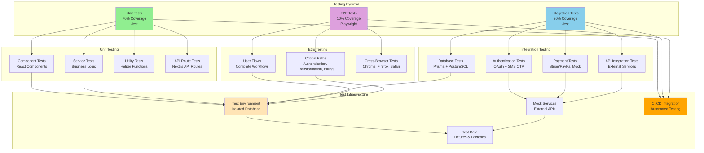

**Testing Strategy:**
- **Unit Tests (70%)**: Component, service, utility, API route tests
- **Integration Tests (20%)**: Database, authentication, payment, API integration tests
- **E2E Tests (10%)**: User flows, critical paths, cross-browser tests
- **Test Infrastructure**: Isolated test environment, mock services, test data, CI/CD integration

---

### 7.2 Testing Flow

Test execution workflow from code change to CI/CD integration.

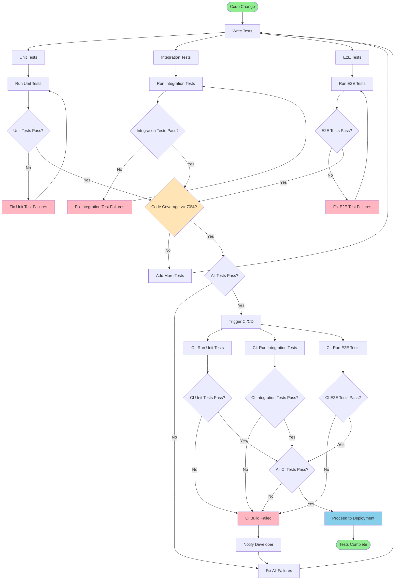

**Testing Process:**
1. **Write Tests**: Create unit, integration, and E2E tests
2. **Run Tests**: Execute tests locally
3. **Fix Failures**: Address any test failures
4. **Coverage Check**: Ensure code coverage >= 70%
5. **CI/CD Integration**: Run tests in CI/CD pipeline
6. **Deploy**: Proceed to deployment if all tests pass

---

### 7.3 Test Coverage by Feature

Testing breakdown by feature area showing unit, integration, and E2E coverage.

```mermaid
graph LR
    subgraph "Authentication Features"
        AUTH_UNIT[Unit: 80%<br/>Auth Logic]
        AUTH_INT[Integration: 15%<br/>OAuth Flow]
        AUTH_E2E[E2E: 5%<br/>Login Flow]
    end
    
    subgraph "Transformation Features"
        TRANS_UNIT[Unit: 75%<br/>Transformation Logic]
        TRANS_INT[Integration: 20%<br/>Gemini API]
        TRANS_E2E[E2E: 5%<br/>Transform Flow]
    end
    
    subgraph "Billing Features"
        BILLING_UNIT[Unit: 85%<br/>Billing Logic]
        BILLING_INT[Integration: 10%<br/>Payment Gateway]
        BILLING_E2E[E2E: 5%<br/>Payment Flow]
    end
    
    subgraph "Admin Features"
        ADMIN_UNIT[Unit: 70%<br/>Admin Logic]
        ADMIN_INT[Integration: 20%<br/>Admin APIs]
        ADMIN_E2E[E2E: 10%<br/>Admin Workflows]
    end
    
    subgraph "User Profile Features"
        PROFILE_UNIT[Unit: 75%<br/>Profile Logic]
        PROFILE_INT[Integration: 15%<br/>Profile APIs]
        PROFILE_E2E[E2E: 10%<br/>Profile Flow]
    end
    
    AUTH_UNIT --> AUTH_INT
    AUTH_INT --> AUTH_E2E
    
    TRANS_UNIT --> TRANS_INT
    TRANS_INT --> TRANS_E2E
    
    BILLING_UNIT --> BILLING_INT
    BILLING_INT --> BILLING_E2E
    
    ADMIN_UNIT --> ADMIN_INT
    ADMIN_INT --> ADMIN_E2E
    
    PROFILE_UNIT --> PROFILE_INT
    PROFILE_INT --> PROFILE_E2E
    
    style AUTH_UNIT fill:#90EE90
    style TRANS_UNIT fill:#90EE90
    style BILLING_UNIT fill:#90EE90
    style ADMIN_UNIT fill:#90EE90
    style PROFILE_UNIT fill:#90EE90
    
    style AUTH_INT fill:#87CEEB
    style TRANS_INT fill:#87CEEB
    style BILLING_INT fill:#87CEEB
    style ADMIN_INT fill:#87CEEB
    style PROFILE_INT fill:#87CEEB
    
    style AUTH_E2E fill:#DDA0DD
    style TRANS_E2E fill:#DDA0DD
    style BILLING_E2E fill:#DDA0DD
    style ADMIN_E2E fill:#DDA0DD
    style PROFILE_E2E fill:#DDA0DD
```

**Feature Coverage:**
- **Authentication**: 80% unit, 15% integration, 5% E2E
- **Transformation**: 75% unit, 20% integration, 5% E2E
- **Billing**: 85% unit, 10% integration, 5% E2E
- **Admin**: 70% unit, 20% integration, 10% E2E
- **User Profile**: 75% unit, 15% integration, 10% E2E

---

## Summary

This visual summary document provides a comprehensive overview of the PixShift application through 16 detailed diagrams covering:

1. **System Architecture** - Complete system components and relationships
2. **User Flows** - Authentication, transformation, and billing workflows
3. **Business Logic** - Free tier enforcement, error handling, configuration management
4. **Data Architecture** - Database schema and relationships
5. **Administration** - Admin dashboard and epic dependencies
6. **Deployment & Operations** - Deployment architecture, flow, and CI/CD pipeline
7. **Testing & Quality** - Testing architecture, flow, and coverage by feature

All diagrams are based on the Product Requirements Document (PRD) and represent the complete system design for the PixShift MVP.

---

## Diagram Usage

These diagrams can be viewed in:
- **GitHub/GitLab**: Mermaid diagrams render automatically in markdown files
- **VS Code**: Install "Markdown Preview Mermaid Support" extension
- **Online**: Copy Mermaid code to [Mermaid Live Editor](https://mermaid.live)
- **Documentation Tools**: Most modern documentation tools support Mermaid

---

**Note:** These diagrams are based on the PRD and may need updates as the architecture evolves.

